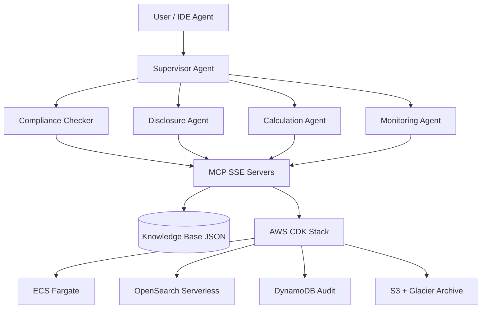

# esg-compliance-agent-skills

[](LICENSE)
[](requirements.txt)
[](skills-index.md)

**Production-grade ESG compliance agent ecosystem** — Supervisor-Worker orchestration, 10 specialized Agent Skills, five SSE MCP servers, local knowledge-base stubs, and multi-region AWS CDK infrastructure for CSRD, EU Taxonomy, SFDR, SEC climate, TNFD, and cross-border data localization.

> **Disclaimer:** This repository provides operational ESG reporting patterns and automation templates. It is **not legal advice** and does not replace qualified sustainability assurance, statutory audit, or legal counsel for regulatory filings.

---

## Architecture



### Supervisor-Worker pattern

The **supervisor** routes tasks by regulatory signal (CSRD disclosure, GHG inventory, taxonomy alignment, sanctions screening) to specialized **worker agents**. Each worker loads progressive-disclosure skills from `skills/` and invokes MCP tools over SSE. Final filings and legal assessments require **human-in-the-loop** approval.

### Multi-region CDK deployment

Infrastructure targets five AWS regions for data residency and latency:

| Region | Role |
| --- | --- |
| `eu-west-1` | EU CSRD / ESEF primary |
| `us-east-1` | SEC climate / SFDR US ops |
| `ap-south-1` | India DPDP localization |
| `ap-southeast-1` | APAC supply-chain due diligence |
| `me-south-1` | Middle East PDPL workloads |

See [infrastructure/esg_compliance_stack.py](infrastructure/esg_compliance_stack.py) for resource definitions.

---

## Quick start

```bash
git clone https://github.com/your-org/esg-compliance-agent-skills.git
cd esg-compliance-agent-skills
chmod +x bootstrap.sh && ./bootstrap.sh   # Windows: .\bootstrap.ps1
```

### Run MCP servers locally (SSE)

Each server exposes tools on a dedicated port:

| Server | Port | Module |
| --- | --- | --- |
| regulatory-db-server | 8001 | `python mcp/regulatory-db-server/server.py` |
| emissions-factor-server | 8002 | `python mcp/emissions-factor-server/server.py` |
| taxonomy-criteria-server | 8003 | `python mcp/taxonomy-criteria-server/server.py` |
| filing-submission-server | 8004 | `python mcp/filing-submission-server/server.py` |
| sanctions-screening-server | 8005 | `python mcp/sanctions-screening-server/server.py` |

### Orchestration

```bash
export MCP_REGULATORY_URL=http://127.0.0.1:8001/sse
python -m orchestration.supervisor_agent "Map CSRD ESRS E1 data points for FY2025"
```

### Deploy infrastructure

```bash
cd infrastructure
pip install -r requirements.txt
cdk bootstrap
cdk deploy --all
```

---

## Lifecycle commands

| Command | Purpose |
| --- | --- |
| `/spec` | Define scope, frameworks, jurisdictions, material topics |
| `/plan` | Produce work breakdown, MCP tool plan, evidence checklist |
| `/build` | Execute skills + MCP tools to produce draft artifacts |
| `/validate` | Schema, XBRL, factor-source, and cross-border checks |
| `/review` | SME / legal review gate (human required) |
| `/backfill` | Historical restatements and audit trail reconciliation |
| `/ship` | Package filings for human-approved submission only |

Full routing: [AGENTS.md](AGENTS.md).

---

## Skills catalog

| # | Skill | Focus |
| --- | --- | --- |
| 01 | `data-ingestion-validation` | CSRD 1,100+ Omnibus data mapping |
| 02 | `ghg-emissions-calculation` | Scopes 1–3, LCA, SBTi |
| 03 | `eu-taxonomy-alignment` | NACE, TSC, DNSH |
| 04 | `double-materiality-assessment` | Impact / financial scoring |
| 05 | `sfdr-pai-computation` | 18 PAIs, Art. 6/8/9 |
| 06 | `audit-trail-reporting` | iXBRL/ESEF, DynamoDB/S3/Glacier |
| 07 | `regulatory-change-monitor` | Global deadline calendar |
| 08 | `supply-chain-due-diligence` | CSDDD, UFLPA |
| 09 | `biodiversity-tnfd-analytics` | TNFD LEAP, MSA, BII |
| 10 | `cross-border-data-transfer` | DPDP, PIPL, PDPL localization |

See [skills-index.md](skills-index.md).

---

## Project structure

```
esg-compliance-agent-skills/
├── AGENTS.md                 # Supervisor routing + lifecycle commands
├── skills/                   # 10 Agent Skills (SKILL.md each)
├── knowledge_base/           # Local JSON stubs pre-OpenSearch
├── mcp/                      # 5 SSE MCP servers + Dockerfiles
├── orchestration/            # Supervisor + worker agents
├── infrastructure/           # AWS CDK app + stack
├── docs/                     # Architecture and setup guides
├── tests/                    # Unit tests
├── scripts/                  # Validation utilities
└── .github/                  # CI workflows
```

---

## License

MIT — see [LICENSE](LICENSE).

Inspired by the engineering patterns in [compliance-agent-skills](https://github.com/vaquarkhan/compliance-agent-skills/releases).
